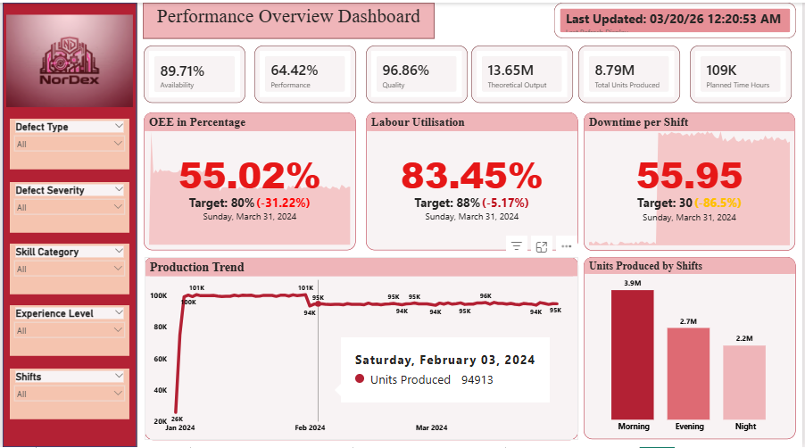
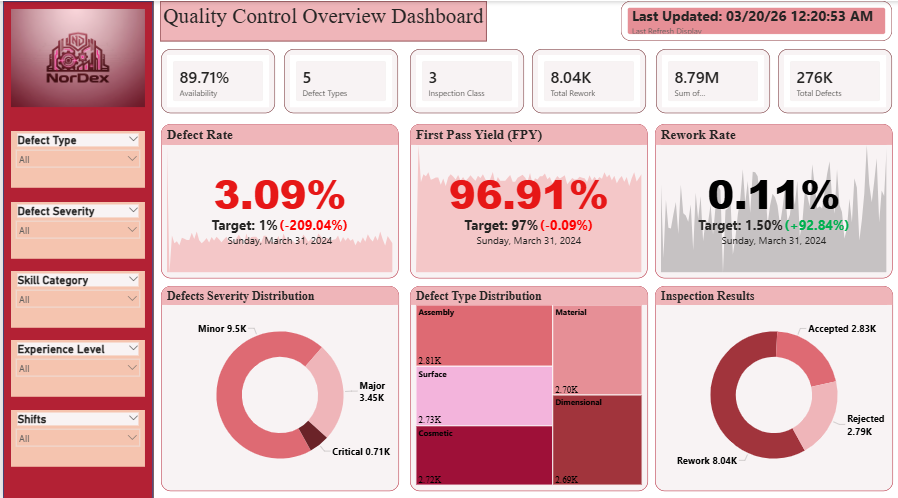
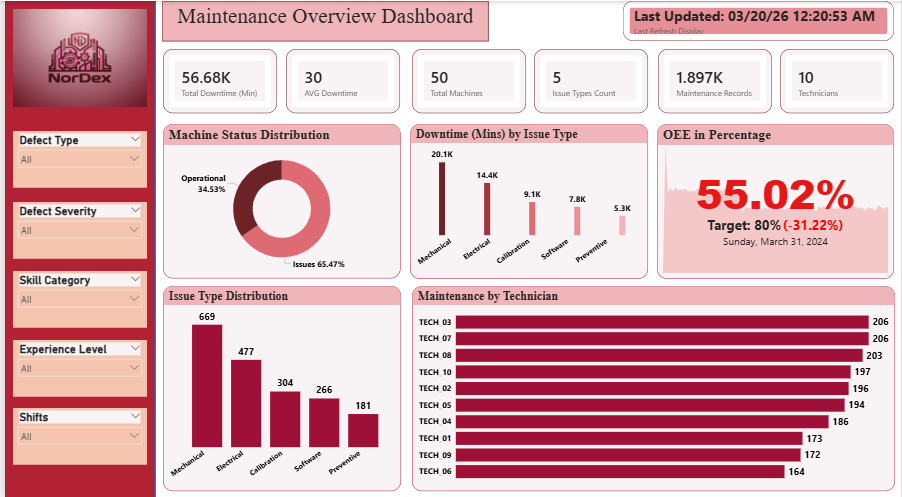
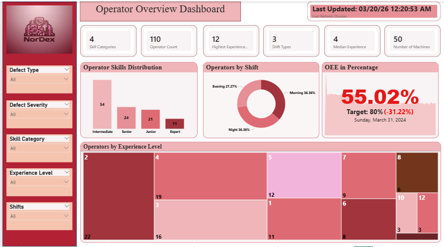

# NorDex Manufacturing - Manufacturing Shifts Performance Analytics and Optimisation

> **Cross-Functional Analytics Project | Power BI | DAX | Power Query | SQLite3**

🔗 **Full Project (Dashboards, Data, Documentation, Presentation):** [Google Drive](https://drive.google.com/drive/folders/1N2BLIqKEnG_SUG0A7qtktFtwjUYiNV1e?usp=sharing)

---
This project delivers a comprehensive analytics solution for **NorDex Manufacturing**, a cross-functional initiative developed collaboratively by Business Analysts, Data Analysts and Data Scientists.

As the Data Analyst, goal was to analyse shift performance across 3 production shifts, benchmark key metrics against **Industry 4.0 and automotive manufacturing standards**, and deliver actionable insights through 4 interactive Power BI dashboards to optimise the operations of the manufacturing firm and maximise production output.

---

## 🚨 Business Problem

- No centralised system to monitor shift performance, machine efficiency or quality metrics in real time
- Operational decisions being made without data driven insight
- Performance gaps against Industry 4.0 standards unidentified and unaddressed

---


🔗 **Original Data Source:** [Google Drive](https://drive.google.com/file/d/1JOyqdfCbdGJODTWUXQ8BqCQprSrLy_d8/view?usp=drive_link)

---

## 📐 KPI Framework

KPIs benchmarked against **Industry 4.0 and Automotive Manufacturing Standards**:

| KPI | Formula | 🟢 Green | 🟡 Yellow | 🔴 Red |
|-----|---------|---------|---------|------|
| OEE % | Availability x Performance x Quality | ≥80% | 70-79% | <70% |
| Availability % | (Planned Time - Downtime) / Planned Time | ≥90% | 80-89% | <80% |
| Performance % | Actual Output / Theoretical Output | ≥95% | 85-94% | <85% |
| Quality % | (Units - Defects) / Units | ≥97% | 94-96% | <94% |
| Labour Utilisation % | Runtime Hours / Planned Hours | ≥88% | 80-87% | <80% |
| Downtime per Shift | Total Downtime / Shifts | ≤30 mins | 30-60 mins | >60 mins |
| Defect Rate % | Defects / Units Produced | ≤1% | 1-2% | >2% |
| First Pass Yield % | Pass Inspections / Total | ≥97% | 94-96% | <94% |
| Rework Rate % | Rework / Total Units | ≤1.5% | 1.5-3% | >3% |

--- 
Dashoards






---

## Key DAX Measures

```dax
-- Availability %
Availability % = 
VAR PlannedTimeMinutes = COUNTROWS(Machine_Log) * 480
VAR TotalDowntimeMinutes = SUM(Machine_Log[downtime_minutes])
RETURN DIVIDE(PlannedTimeMinutes - TotalDowntimeMinutes, PlannedTimeMinutes)

-- Performance %
Performance % = 
DIVIDE(
    SUM(Production_Log[units_produced]),
    COUNTROWS(Production_Log) * 1000
)

-- Quality %
Quality % = 
DIVIDE(
    SUM(Production_Log[units_produced]) - SUM(Production_Log[defect_count]),
    SUM(Production_Log[units_produced])
)

-- OEE %
OEE % = 
VAR Avail = [Availability %]
VAR Perf  = [Performance %]
VAR Qual  = [Quality %]
RETURN Avail * Perf * Qual

-- Defect Rate %
Defect Rate % = 
DIVIDE(
    SUM(Production_Log[defect_count]),
    SUM(Production_Log[units_produced])
)

-- Labour Utilisation %
Labour Utilisation % = 
DIVIDE(
    SUM(Machine_Log[runtime_hours]),
    COUNTROWS(Machine_Log) * 8
)
```

---

## Key Findings

### Overall Performance vs Industry 4.0 Benchmarks

| KPI | Actual | Target | Status |
|-----|--------|--------|--------|
| OEE % | 54.92% | 80% | 🔴 Critical |
| Availability % | 89.71% | 90% | 🟡 Warning |
| Performance % | 64.42% | 95% | 🔴 Critical |
| Quality % | 96.86% | 97% | 🟡 Warning |
| Defect Rate % | 3.09% | 1% | 🔴 Critical |

### Shift Performance Comparison

| Shift | OEE % | Labour Utilisation % | Downtime (mins) | Status |
|-------|-------|---------------------|-----------------|--------|
| Morning | 76.77% | 87.64% | 29.31 | 🟡 Warning |
| Evening | 50.71% | 83.16% | 50.82 | 🔴 Critical |
| Night | 39.07% | 79.56% | 68.12 | 🔴 Critical |

### Critical Insights
- 🔴 **Night shift** consistently ranked lowest across ALL KPIs with no Expert level operators assigned
- 🔴 **Defect Rate at 3.09%** — more than 3x the 1% industry green threshold
- 🔴 **Performance % at 64.42%** — the biggest drag on OEE
- 🔴 **Mechanical and Electrical Faults** account for over 60% of all downtime causes
- ⚠️ **Unrecorded downtime** — machines experiencing downtime with no maintenance records logged

---

## 🌍 SDG 9 Advocacy

This project aligns with **UN Sustainable Development Goal 9 — Industry, Innovation and Infrastructure**. By leveraging data analytics to drive smarter manufacturing decisions, advance industrial resilience, close efficiency gaps and support sustainable industrialisation.

